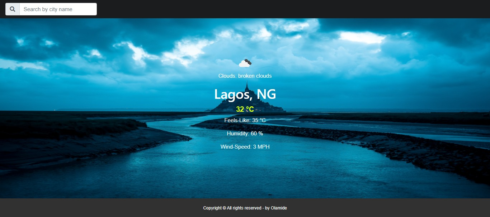

# Weather-App
This project is a weather forecast site, using the weather API. Here a user is able to search for a specific location and toggle displaying the data in Fahrenheit or Celsius.

## Live-Demo

[Check-Weather](https://rawcdn.githack.com/AkintoyeOlamide/Weather-app/207978c5aa3ec7052fbbe3ade794f6c3556d2cc6/src/index.html)

## Screen-shots:

## Build-With

- HTML5
- CSS3
- JavaScript Webpack
- VScode

## Getting Started

### Prerequisites

To get this project up and running locally, "npm install" is needed to be run in order to include all dependencies used for this project.

**To get this project set up on your local machine, follow these simple steps:**

1. Open Terminal.
2. Navigate to your desired location to download the contents of this repository.
3. Copy and paste the following code into the Terminal: git clone https://github.com/AkintoyeOlamide/Weather-app
4. cd to the folder "dist".
5. click on the "index.html".

## Author Details::

👤 **AKintoye**

- Github: [@AkintoyeOlamide](https://github.com/AkintoyeOlamide)
- Linkedin: [@LamiaSristy](https://www.linkedin.com/in/Akintoye-Olamide/)

## Show your support

Give ⭐ Star me on GitHub — it helps!

## 📝 License

This project is [MIT](lic.url) licensed.
